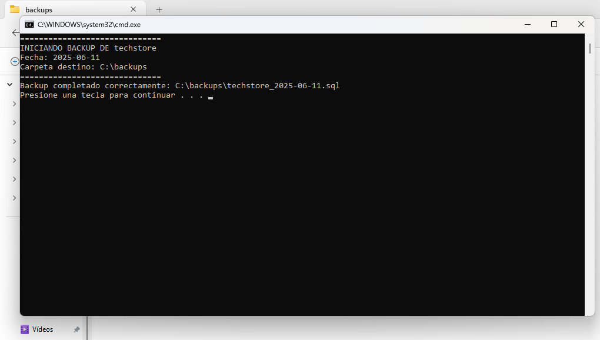
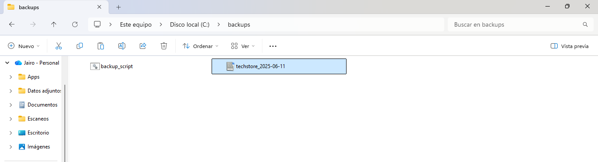
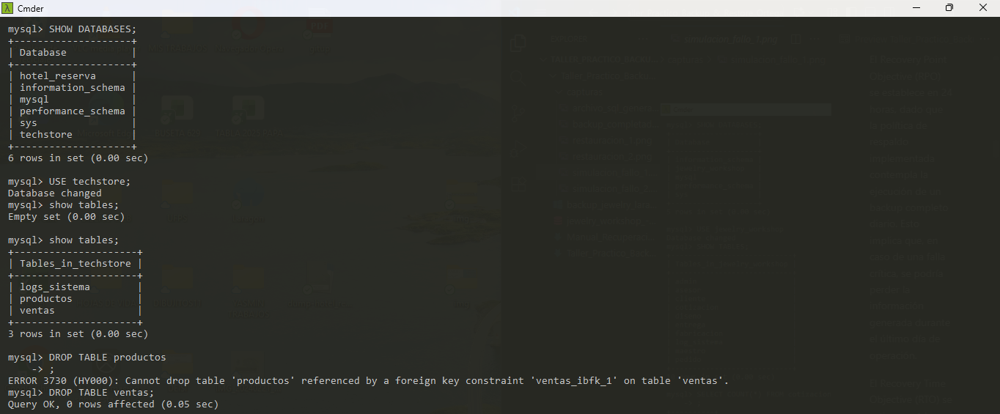
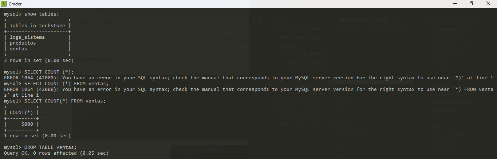
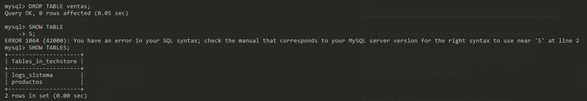
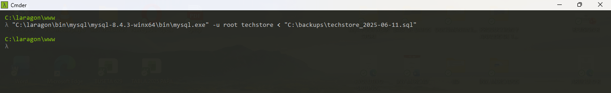
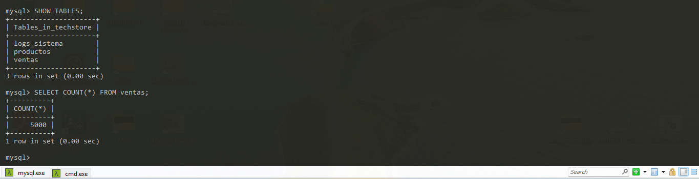

# Taller Práctico Integrador – Bases de Datos
> **Tema:** Implementación de Backup y Restore en MySQL

> **Proyecto:** Tech Store

> **Autores:** Jairo Rincon - Camilo Cuvides

> **Docente:** Hely Suarez Marín

> **Fecha:** 06 de noviembre de 2025
FESC
---

## Introducción

El presente taller práctico tiene como objetivo implementar un sistema de respaldo y recuperación de datos en MySQL, garantizando la integridad y disponibilidad de la información mediante la aplicación de políticas de backup, ejecución de copias automáticas y validación del proceso de restauración.

---

## Objetivos

### Objetivo general
Implementar un mecanismo de respaldo y restauración de bases de datos en MySQL aplicando políticas RPO y RTO

### Objetivos específicos
- Generar datos masivos en tablas principales (ventas, productos, logs_sistema). 
- Realizar copias de seguridad completas con mysqldump.  
- Ejecutar la restauración del respaldo y verificar su integridad.
- Documentar el proceso con evidencias técnicas y conclusiones. 

---

## Política de Backup y Restore (MySQL – Tech Store)

El Recovery Point Objective (RPO) se establece en 24 horas, dado que la política de respaldo implementada contempla la ejecución de un backup completo diario. Esto implica que, en caso de una falla crítica, se podría perder la información generada durante el último día de operación.

El Recovery Time Objective (RTO) se estima en 1 hora, tiempo suficiente para ubicar el respaldo, ejecutar la restauración y verificar la integridad de los datos en un entorno local.


| **Elemento** | **Descripción** |
|---------------|-----------------|
| **RPO (Recovery Point Objective)** | 1 hora |
| **RTO (Recovery Time Objective)** | 1 hora |
| **Tipo de Backup** | Completo diario |
| **Retención** | 30 días de historial de copias almacenadas. |
| **Ubicación** | `C:\backups\` |
| **Herramienta usada** | `mysqldump` – MySQL 8.4.3 (entorno Laragon) |
| **Automatización** | Script `.bat` con fecha dinámica para generar el respaldo automáticamente y almacenarlo con el nombre del día. |

## Evidencias del Proceso de Backup y Restauración

A continuación, se presentan las capturas de evidencia correspondientes a cada proceso del taller práctico integrador “Implementación de Backup y Restore (MySQL)” desarrollado en el entorno **Laragon – MySQL 8.4.3**.

---

### Evidencia 1 – Ejecución del Script `.bat`


> Esta captura muestra la ejecución exitosa del archivo `backup_script_laragon.bat`.  
> Se observa el mensaje “Backup completado correctamente”, confirmando que la base de datos **Tech Store** fue respaldada sin errores en la ruta `C:\backups\`.

---

### Evidencia 2 – Archivo `.sql` Generado


> En esta evidencia se visualiza el archivo **`techstore_2025-06-11`** generado automáticamente por el script.  
> Su presencia y tamaño confirman que el respaldo fue creado correctamente dentro de la carpeta `C:\backups\`.

---

### Evidencia 3 – Simulación de Falla (Eliminación de Tabla)




> En esta fase se simula una pérdida de información eliminando la tabla `ventas`.  
> Las capturas muestran la ejecución del comando `DROP TABLE ventas;` y la verificación posterior de que la tabla ya no aparece en el listado (`SHOW TABLES;`).

---

### Evidencia 4 – Restauración desde el Backup



> Estas capturas demuestran la restauración completa de la base de datos desde el respaldo almacenado.  
> El comando ejecutado fue:
> ```bash
> "C:\laragon\bin\mysql\mysql-8.4.3-winx64\bin\mysql.exe" -u root techstore < "C:\backups\techstore_2025-06-1l.sql"
> ```
> Se evidencia que el proceso concluyó sin errores y las tablas fueron recuperadas correctamente.

---

### Evidencia 5 – Verificación de Integridad de los Datos


> Finalmente, se validan los registros restaurados mediante consultas de conteo (`SELECT COUNT(*)`).  
> Los resultados muestran:
> - `ventas`: **5000**  
> Lo cual confirma que el proceso de respaldo y recuperación conserva la integridad de la información.


---

## Script de Automatización del Backup (archivo `.bat`)

A continuación, se muestra el contenido comentado del script utilizado para automatizar el proceso de respaldo de la base de datos **`techstore`**.  
El script fue ejecutado en el entorno **Laragon – MySQL 8.4.3**, generando un archivo `.sql` con fecha dinámica en la carpeta `C:\backups\`.

```bat
@echo off
REM ============================================
REM   SCRIPT AUTOMATIZADO DE BACKUP MYSQL
REM   Proyecto: Tech Store - Taller FESC
REM   Desarrollado en Laragon (MySQL 8.4.3)
REM ============================================

REM === FORMATO DE FECHA UNIVERSAL ===
REM Captura la fecha del sistema (dd/mm/yyyy) y la reorganiza a formato yyyy-mm-dd
for /f "tokens=2-4 delims=/ " %%a in ('date /t') do (
  set FECHA=%%c-%%a-%%b
)

REM === CONFIGURACIÓN ===
REM Define las variables principales:
REM - BK_DIR: Carpeta donde se almacenará el backup
REM - MYSQLDUMP: Ruta del ejecutable mysqldump
REM - DB: Nombre de la base de datos a respaldar
REM - FILE: Ruta y nombre final del archivo generado
set "BK_DIR=C:\backups"
set "MYSQLDUMP=C:\laragon\bin\mysql\mysql-8.4.3-winx64\bin\mysqldump.exe"
set "DB=techstore"
set "FILE=%BK_DIR%\%DB%_%FECHA%.sql"

REM === CREAR CARPETA SI NO EXISTE ===
REM Verifica si la carpeta C:\backups existe; si no, la crea automáticamente.
if not exist "%BK_DIR%" mkdir "%BK_DIR%"

REM === MENSAJE INICIAL DE ESTADO ===
REM Muestra en consola la información básica del respaldo.
echo ==============================
echo INICIANDO BACKUP DE %DB%
echo Fecha: %FECHA%
echo Carpeta destino: %BK_DIR%
echo ==============================

REM === EJECUTAR BACKUP ===
REM Llama al ejecutable mysqldump con los parámetros de respaldo.
REM --single-transaction evita bloqueos mientras se copia la base de datos.
REM --routines, --events y --triggers aseguran que se respalden también procedimientos, eventos y disparadores.
call "%MYSQLDUMP%" -u root %DB% --single-transaction --routines --events --triggers > "%FILE%"

REM === VERIFICACIÓN DEL RESULTADO ===
REM Comprueba si el archivo SQL fue creado correctamente.
if exist "%FILE%" (
    echo Backup completado correctamente: %FILE%
) else (
    echo Error: no se creó el archivo de backup.
)

REM === FINALIZAR ===
REM Pausa la consola para permitir al usuario ver el resultado antes de cerrar.
pause
```
---

## Conclusiones

1. La implementación del proceso de **backup y restauración en MySQL** nos permitió comprender la importancia de garantizar la continuidad operativa de una base de datos ante posibles fallos del sistema.  
2. El uso del comando `mysqldump` facilitó la generación de copias completas, seguras y portables del sistema **Tech Store**, asegurando la integridad de los datos.  
3. La simulación de fallos y posterior restauración evidenció la eficacia del respaldo, validando los objetivos definidos en la política de RPO (1 h) y RTO (1 h).  
4. La automatización mediante un **script `.bat`** demostró que los procesos de mantenimiento pueden optimizarse con herramientas simples pero bien configuradas.  


---
